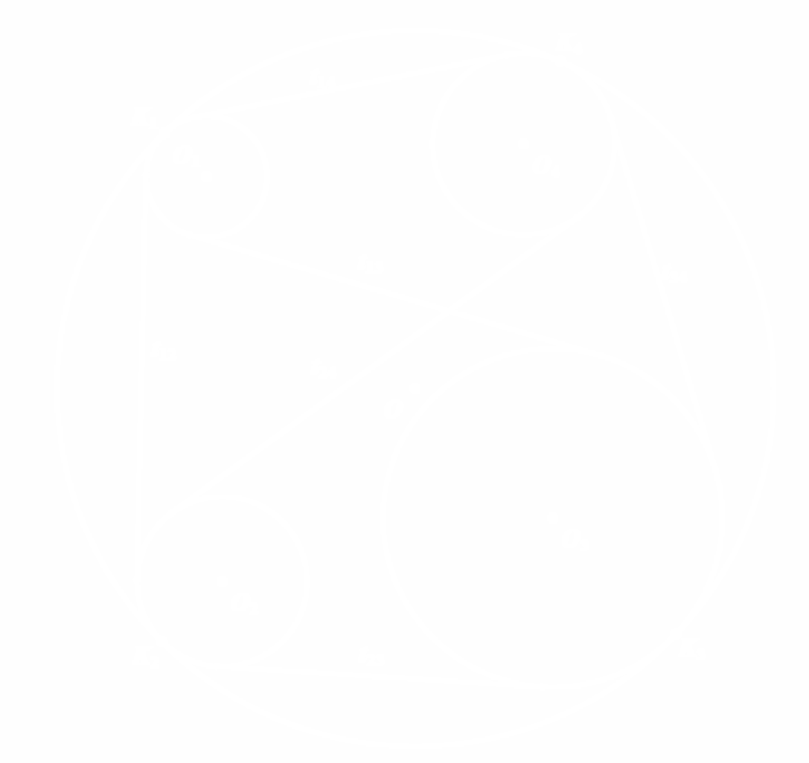
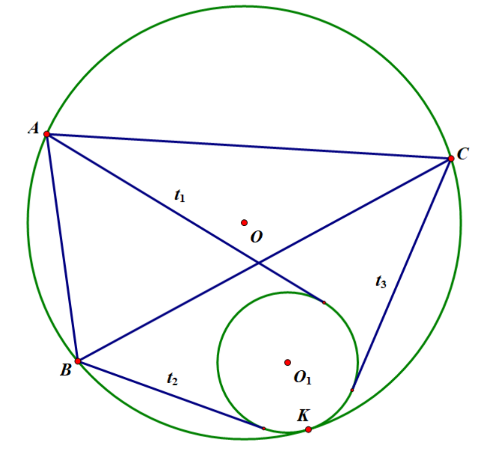
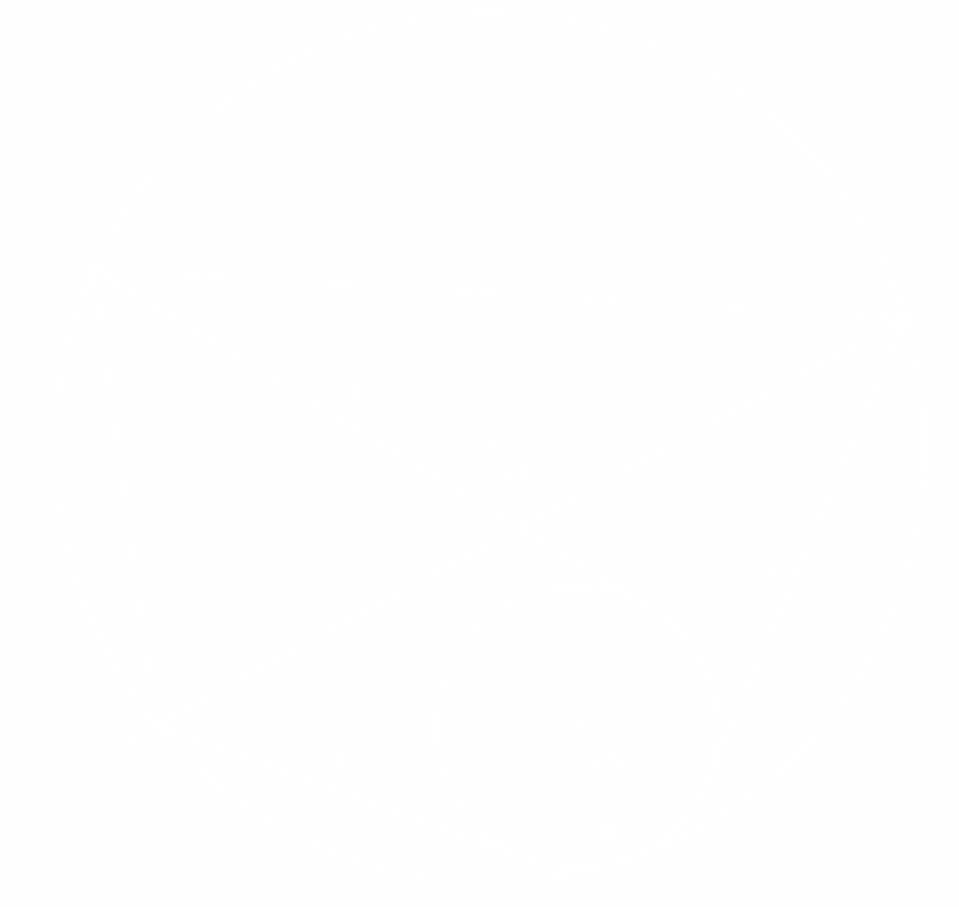

基于相切的定义进行的证明不再赘述，这里我想引入一个重要的定理：开世定理。

---

    

    

$\space$

    如图，$\odot o_1$,$\odot o_2$, $\odot o_3$,$\odot o_4$是四个内切于$\odot o$的圆，$t_{i j}$为$\odot o_i$与$\odot o_j$的外公切线的长($\forall i \neq j$)，那么有：
    $$ t_{1 2}t_{3 4}+t_{1 4}t_{2 3}=t_{1 3}t_{2 4} $$

---

??? proof "定理之证明"
    证明：设$\odot o$的圆心是点$O$，半径是$R$，四个圆的圆心分别是点$O_1,O_2,O_3,O_4$，半径分别是$R_1,R_2,R_3,R_4$，每个圆与$\odot o$的切点分别是$K_1,k_2,K_3,K_4$。那么我们可以得到：
    $$ t_{ij}^2=O_i O_j^2-(R_i-R_j)^2 ,\forall i \neq j (\star) $$
    而$$ O_i O_j^2=O O_i^2 +O O_j^2 - 2O O_i \cdot O O_j \cos \angle O_i O O_j $$
    $$ =(R-R_i)^2+(R-R_j)^2-2(R-R_i)(R-R_j)\cos \angle K_i O K_j , $$
    $$ \cos \angle K_i O K_j = 1 - 2 \sin^2 \dfrac{\angle K_i O K_j}{2} = 1-2(\dfrac{K_i K_j}{2R})^2 $$

    代入$(\star)$式有：
    $$ t_{ij}^2=2R^2-2R(R_i+R_j)+R_i^2+R_j^2-(R^2-R(R_i+R_j)+R_i R_j)(2-\dfrac{K_i K_j^2}{R^2})-(R_i-R_j)^2 $$
    $$ =(R_i-R_j)^2+\dfrac{(R-R_i)(R-R_j)(K_i K_j^2)}{R^2-(R_i-R_j)^2}=\dfrac{(R-R_i)(R-R_j)(K_i K_j^2)}{R^2} $$
    即$$ t_{ij}=K_i K_j \sqrt{\dfrac{(R-R_i)(R-R_j)}{R}} $$
    故由托勒密定理，
    $$ t_{12}t_{34}+t_{1 4}t_{2 3}=\sqrt{\dfrac{(R-R_1)(R-R_2)(R-R_3)(R-R_4)}{R^2}} (K_1K_2 \cdot K_3K_4+K_1K_4 \cdot K_2K_3) $$
    $$ =\sqrt{\dfrac{(R-R_1)(R-R_2)(R-R_3)(R-R_4)}{R^2}} (K_1K_3 \cdot K_2K_4)=t_{1 3}t_{2 4} $$得证.

    
$\Box$

（将任意一个圆的内切改为外切，结论也是成立的）

---

其逆定理也成立，即只要这四个圆的外公切线满足$(\star)$式，那么这四个圆就与某一个圆相切。

值得一提的是，开世定理的退化情形也成立，当四个圆均退化成点时即为托勒密定理；而只有三个圆退化为点时即有如下结论：

    

    

$\space$

    $A,B,C$为$\odot O$上任意三点，$t_1,t_2,t_3$为$A,B,C$到$\odot O_1$的切线长，则有：

    $\odot O_1$与$\odot O$相切 $\Leftrightarrow$ $A B \cdot t_3+A C \cdot t_2=B C \cdot t_1$

---

这种方法的优点在于，我们不需要知道两圆的交点并证明它是切点（相比之下，使用纯几何方法证明时需要知道这个），而只需要知道三个点以及切线长即可——这一好处是我们可以选择恰当的$A,B,C$来使得计算更简洁。
