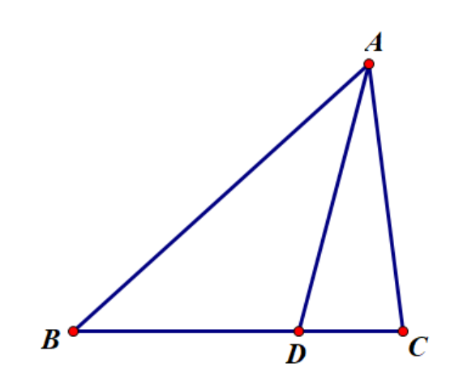

正弦定理：  
对$\triangle ABC$，有
$\dfrac{a}{\sin A}=\dfrac{b}{\sin B}=\dfrac{c}{\sin C}=2R$.

---

??? proof "定理之证明"
    证明是简单的，左边两个等号只需要注意到 $a\sin B=b\sin A=c$上的高，而最后一个等号需要用到三角形外接圆以及圆周角相等. 
$\Box$

---

正弦定理的奠基性在于它定量地刻画了三角形的一个概念：大边对大角，也定量地刻画了三角形的边和角的关系，使得它可以作为一系列基本定理的证明工具。

=== "共边比例定理"
    

        
    

    

        
    

    

        如图，$\triangle ABC$及$BC$边上一点$D$，有$\dfrac{S_{\triangle ABD}}{S_{\triangle ADC}}=\dfrac{BD}{DC}$.
    

    ??? proof "定理之证明"
        

            证明：利用正弦定理与面积公式$S_{\triangle ABC}=\frac{1}{2}ab\sin C$得：
        

        

            $\dfrac{S_{\triangle ABD}}{S_{\triangle ADC}}=\dfrac{c\times BD\sin B}{b\times DC\sin C}=\dfrac{BD}{DC}$. 得证。
$\Box$

        

=== "分角定理"
    

        
    

    

        
    

    (<s>对还是这张图</s>)  
    

        如图，$\triangle ABC$及$BC$边上一点$D$，有$\dfrac{BD}{DC}=\dfrac{AB\sin\angle BAD}{AC\sin\angle DAC}$.
    

    ??? proof "定理之证明"
        

            证明：利用借助正弦定理证明的共边比例定理以及面积公式$S_{\triangle ABC}=\frac{1}{2}ab\sin C$得：
        

        

            $\dfrac{BD}{DC}=\dfrac{S_{\triangle ABD}}{S_{\triangle ADC}}=\dfrac{\frac12 AB\times AD\sin\angle BAD}{\frac12 AD\times AC\sin\angle DAC}=\dfrac{AB\sin\angle BAD}{AC\sin\angle DAC}$. 得证。
$\Box$

        

---

??? Tip "比例的写法"
    这里我们采用了$\dfrac{BD}{DC}$，$\dfrac{\sin\angle BAD}{\sin\angle DAC}$，$\dfrac{S_{\triangle ABD}}{S_{\triangle ADC}}$的写法，是有讲究的，具体如下：
    <ul style="line-height: 2;">
        <li>
            $\dfrac{BD}{DC}$为形如 (始点($B$)$\rightarrow$分点($D$))/(分点($D$)$\rightarrow$终点($C$)) 的比例写法，在后续定理中也会多次体现，这样书写“分比”有利于我们书写比例。
        </li>
        

        <li>
            $\dfrac{\sin\angle BAD}{\sin\angle DAC}$也类似于起边 $\rightarrow$ 分边 $\rightarrow$ 终边的写法，但是一般我们用有向角解释：  
            有向角：以$AB$为始边，$AC$为终边的角记为$\measuredangle BAC$，逆时针角的大小为正，顺时针为负。  
            由于有向角的存在，我们希望角度的起点 $\rightarrow$ 顶点 $\rightarrow$ 终点满足逆时针，这样分数线上下的角能够保持同号.
        </li>
        

        

        <li>
            $\dfrac{S_{\triangle ABD}}{S_{\triangle ADC}}$的写法也是因为有向面积的概念，我们不再解释：  
            有向面积：以$A,B,C$为逆时针顺序的三角形的面积记为$[A B C]$，顺时针面积为负。
        </li>
        

    </ul>
